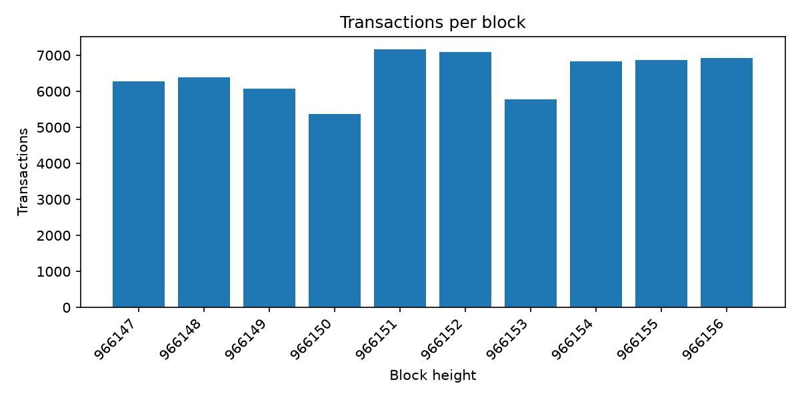
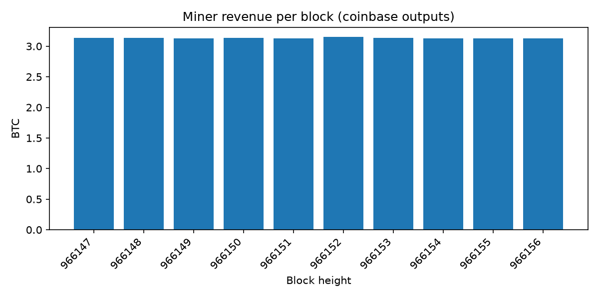

# Bitcoin Data Pipeline (local-first)

An end-to-end ETL + analytics pipeline for Bitcoin blockchain data. It pulls
recent blocks from a public API, flattens and validates them, loads them into
a SQL warehouse, models them with dbt, and plots the results.

Everything runs locally and for free. The goal was to get the pipeline logic
right first, and only add cloud infrastructure once that logic was proven.

Architecture is modeled on
[fenniez2334/blockchain-data-pipeline](https://github.com/fenniez2334/blockchain-data-pipeline),
scaled down to run on a laptop.

## What it does

```
mempool.space API -> extract -> transform -> validate -> load -> dbt -> charts
                     (cache)    (flatten)    (checks)    (DuckDB) (models/tests)
```

1. **Extract** (`extract/fetch.py`): pulls the 10 most recent blocks and their
   transactions from the mempool.space REST API. Raw responses are cached in
   `data/raw/` so reruns don't hit the API.
2. **Transform** (`transform/flatten.py`): flattens the nested
   blocks -> transactions -> inputs/outputs JSON into four flat tables.
   Coinbase transactions have no real inputs, and some outputs have no
   address; missing addresses are stored as NULL.
3. **Validate** (`transform/validate.py`): null checks on key columns,
   duplicate checks on primary keys, and foreign-key checks
   (transactions -> blocks, inputs/outputs -> transactions). All failures are
   reported in a single error before anything is loaded.
4. **Load** (`load/warehouse.py`): writes the tables into a local DuckDB file.
5. **Model** (`dbt/`): dbt staging views and mart tables on top of the raw
   tables, with `not_null` / `unique` tests on primary keys.
6. **Analyze** (`analytics/`): plain SQL queries and a plotting script.

## Results




## Run it

```
pip install -r requirements.txt
python run_pipeline.py                                  # extract -> transform -> validate -> load
dbt run  --project-dir dbt --profiles-dir dbt           # build staging + mart models
dbt test --project-dir dbt --profiles-dir dbt           # run data tests
python -m analytics.query                               # print every SQL query in analytics/sql/
python -m analytics.plot                                # save charts to docs/
```

## Project structure

```
extract/         raw data in (mempool.space API, cached; synthetic sample in mock_data.py)
transform/       flatten nested blocks, then validate them
load/            write flat tables into DuckDB
dbt/             staging models, mart models, tests
analytics/       SQL queries (analytics/sql/) and plot.py
run_pipeline.py  ties extract -> transform -> validate -> load together
```

## Design decisions

- **Local-first, free tools.** DuckDB stands in for BigQuery, pandas stands in
  for Spark, and plain Python stands in for an orchestrator. Same ideas, no cost.
- **mempool.space instead of the BigQuery public dataset.** Setting up a GCP
  billing account kept failing, so I used the free REST API instead.
- **Synthetic data first.** I proved the pipeline shape on generated data
  before switching to real data, so problems with real data were easier to spot.
- **Validation before load.** Bad data fails loudly instead of silently
  reaching the warehouse.
- **Transaction volume comes from `blocks.transaction_count`**, not from
  counting rows in `transactions`, because only a sample of transactions
  (25 per block) is stored.

## Limitations

- Only 10 recent blocks, so the "daily" models have a single row. The charts
  are per block for that reason.
- Only a sample of transactions per block is stored.
- No orchestration or scheduling; the pipeline is run manually.

## Possible next steps

Terraform for a GCP VM, Kestra for orchestration, and Spark/Dataproc to run
at the scale the reference repo targets.